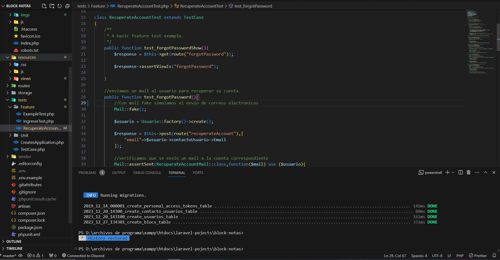

# Bloc de notas personal

Bloc en el cual podras crear,modificar y eliminar notas personales

## Tabla de contenidos

- [Sistema](#informacion-sistema)
- [Comenzar](#comenzar)
- [Configuracion](#configuracion)
    -[Database](#db-config)
    -[Email](#email-config)
-[Test](#test)

### informacion-sistema

Como dijimos, esta app sera un bloc de notas personal, por lo cual el usuario que quiera utilizarlo debera previamente registarse en la aplicacion,completando ciertos datos personales.


### comenzar

Para poder utilizar esta app es necesario tener intalado php,MySQL,disponer de un email para que los usuarios puedan recuperar su cuenta,asi como contar con un servidor web como xammp.
Por siguiente sera necesario clonar el repositorio

```bash
git clone https://github.com/LuisVillalba1/bloc-notas?tab=readme-ov-file
```

### configuracion

Para comenzar es importante realizar un par de configuraciones.Esta app utilizara MySQL y un mail para recuperar la cuenta

#### db-config

Para configurar tu base de datos es importante irte a la rama principal del proyecto y crear un archivo que se llame ".env"

En esta tendras que crear las siguientes Claves

- DB_CONNECTION
- DB_HOST
- DB_PORT
- DB_DATABASE
- DB_USERNAME
- DB_PASSWORD

1. DB_CONNECTION: Seria el tipo de base de datos que utilizaremos, en este caso "mysql".
2. DB_HOST: El host de nuestra base de datos si es como uso propio normalmente utilizaremos localhost.
3. DB_PORT: El puerto que utiliza tu base de datos normalmente es el puerto 3306
4. DB_DATABASE : Este sera el nombre de nuestro esquema.Para este es importante ya tener creado el esquema correspondiente antes de correr el programa
5. DB_USERNAME : El nombre con el cual ingresas a tu base de datos
6. DB_PASSWORD : La contraseña correspondiente

#### email-config

Para configurar el email que vamos a utilizar para enviar los datos sobre la reserva tenemos que el el mismo archivo .env agregar las siguientes claves:

- MAIL_MAILER
- MAIL_HOST
- MAIL_PORT
- MAIL_USERNAME
- MAIL_PASSWORD
- MAIL_ENCRYPTION
- MAIL_FORM_ADDRESS
- MAIL_FROM_NAME

1. MAIL_MAILER: Este sera el protocolo con el cual enviaremos los mail, en este caso el mas habitual es "smtp".
2. MAIL_HOST : En el caso de que se utilize una cuenta de gmail se debera de ingresar "smtp.gmail.com".
3. MAIL_PORT : El puerto que se utilizara email para las conexiones smtp,587.
4. MAIL_USERNAME: Aqui iria su email correspondiente.
5. MAIL_PASSWORD: Aqui es recomensado no utilizar la contraseña de su cuenta de email, si no una contraseña de aplicaciones la cual se puede generar luego de hacer la verifiacion en dos pasos en su cuenta de email.
6. MAIL_ENCRYPTION : El tipo de cifrado que utilizaremos para enviar los email, "tls".
7. MAIL_FROM_ADDRES : Aqui iria de nuevo su email correspondiente.
8. MAIL_FROM_NAME : El nombre que quiere que le aparesca a los usuarios cuando reciben un correo electronico.

### test

La app contara con testing correspondientes a cada peticion htpp que se realiza en la app



Para poder correr los test se debera ejecutar en la terminal el siguiente comando:

```bash
php artisan test
```

[EOF]
